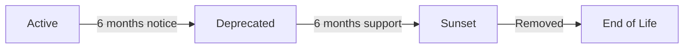

# API Versioning Strategy

## Overview

This document outlines the API versioning strategy for A Fine Wine Dynasty, including version management, deprecation policies, and migration guidelines.

## Versioning Principles

### Semantic Versioning
We follow semantic versioning (SemVer) principles for our API:
- **Major version** (v1, v2): Breaking changes
- **Minor version** (1.1, 1.2): New features, backward compatible
- **Patch version** (1.1.1, 1.1.2): Bug fixes, backward compatible

### URL Path Versioning
API versions are included in the URL path:
```
https://api.afinewinedynasty.com/api/v1/prospects
https://api.afinewinedynasty.com/api/v2/prospects
```

## Version Lifecycle

### Current Versions

| Version | Status | Release Date | End of Life | Notes |
|---------|--------|--------------|-------------|-------|
| v1 | Active | 2024-01-01 | TBD | Current stable version |
| v2 | Beta | 2024-10-01 | TBD | New features, testing phase |

### Version States

1. **Beta**: New version under development
2. **Active**: Current recommended version
3. **Deprecated**: Still functional but not recommended
4. **Sunset**: No longer available

## Breaking Changes Policy

### What Constitutes a Breaking Change

Breaking changes require a major version increment:
- Removing an endpoint
- Removing a field from response
- Changing field type or format
- Changing authentication method
- Modifying business logic that changes expected behavior

### Non-Breaking Changes

These can be added in minor versions:
- Adding new endpoints
- Adding optional fields to requests
- Adding fields to responses
- Adding new optional parameters
- Performance improvements

## Deprecation Policy

### Deprecation Timeline



### Deprecation Process

1. **Announcement** (T-6 months)
   - Email notification to all API users
   - Deprecation notice in API documentation
   - Warning headers in API responses

2. **Deprecation** (T-0)
   - API returns `Deprecation` header
   - Warning in response metadata
   - Documentation marked as deprecated

3. **Sunset** (T+6 months)
   - API returns 410 Gone status
   - Migration guide provided
   - Support ends

### Deprecation Headers

Deprecated endpoints include warning headers:
```http
Deprecation: true
Sunset: Sat, 31 Dec 2024 23:59:59 GMT
Link: <https://api.afinewinedynasty.com/api/v2/docs>; rel="successor-version"
Warning: 299 - "This API version is deprecated. Please migrate to v2"
```

## Implementation Details

### FastAPI Versioning Structure

```python
# app/api/api_v1/api.py
from fastapi import APIRouter
from app.api.api_v1.endpoints import prospects, auth, subscriptions

api_router_v1 = APIRouter()
api_router_v1.include_router(auth.router, prefix="/auth", tags=["auth"])
api_router_v1.include_router(prospects.router, prefix="/prospects", tags=["prospects"])
api_router_v1.include_router(subscriptions.router, prefix="/subscriptions", tags=["subscriptions"])

# app/api/api_v2/api.py
from fastapi import APIRouter
from app.api.api_v2.endpoints import prospects, auth, subscriptions

api_router_v2 = APIRouter()
# V2 endpoints with enhanced features
```

### Main Application Setup

```python
# app/main.py
from fastapi import FastAPI
from app.api.api_v1.api import api_router_v1
from app.api.api_v2.api import api_router_v2

app = FastAPI()

# Mount version routers
app.include_router(api_router_v1, prefix="/api/v1")
app.include_router(api_router_v2, prefix="/api/v2")

# Version discovery endpoint
@app.get("/api/versions")
async def get_api_versions():
    return {
        "versions": [
            {
                "version": "v1",
                "status": "active",
                "deprecated": False,
                "sunset_date": None,
                "documentation": "/api/v1/docs"
            },
            {
                "version": "v2",
                "status": "beta",
                "deprecated": False,
                "sunset_date": None,
                "documentation": "/api/v2/docs"
            }
        ],
        "recommended": "v1",
        "latest": "v2"
    }
```

### Middleware for Deprecation Warnings

```python
# app/middleware/deprecation.py
from fastapi import Request, Response
from datetime import datetime

DEPRECATED_VERSIONS = {
    "v0": {
        "deprecated": True,
        "sunset_date": "2024-12-31T23:59:59Z",
        "successor": "v1"
    }
}

async def deprecation_middleware(request: Request, call_next):
    response = await call_next(request)

    # Check if request is to deprecated version
    path_parts = request.url.path.split('/')
    if len(path_parts) > 2 and path_parts[2] in DEPRECATED_VERSIONS:
        version = path_parts[2]
        deprecation_info = DEPRECATED_VERSIONS[version]

        response.headers["Deprecation"] = "true"
        response.headers["Sunset"] = deprecation_info["sunset_date"]
        response.headers["Link"] = f'</api/{deprecation_info["successor"]}/docs>; rel="successor-version"'
        response.headers["Warning"] = f'299 - "API version {version} is deprecated. Please migrate to {deprecation_info["successor"]}"'

    return response
```

## Migration Guides

### V1 to V2 Migration Example

#### Authentication Changes
```python
# V1 - Token in custom header
headers = {
    "X-Auth-Token": "your-token"
}

# V2 - Standard Bearer token
headers = {
    "Authorization": "Bearer your-token"
}
```

#### Response Format Changes
```python
# V1 Response
{
    "data": [...],
    "total": 100
}

# V2 Response (with metadata)
{
    "data": [...],
    "metadata": {
        "total": 100,
        "page": 1,
        "per_page": 20
    }
}
```

#### Endpoint Changes
```python
# V1 Endpoints
GET /api/v1/prospects/list
GET /api/v1/prospects/get/{id}

# V2 Endpoints (RESTful)
GET /api/v1/prospects
GET /api/v1/prospects/{id}
```

## Client Libraries

### Version Support in SDKs

```python
# Python SDK
from afwd_client import Client

# Specify version explicitly
client = Client(api_key="your-key", version="v1")

# Or use latest stable
client = Client(api_key="your-key")  # Uses recommended version
```

```javascript
// JavaScript SDK
import { AFWDClient } from '@afwd/client';

// Specify version
const client = new AFWDClient({
  apiKey: 'your-key',
  version: 'v1'
});

// Version check
if (client.isVersionDeprecated()) {
  console.warn('API version is deprecated, please upgrade');
}
```

## Version-Specific Features

### Feature Availability Matrix

| Feature | v1 | v2 | Notes |
|---------|----|----|-------|
| Basic Prospect Data | ✅ | ✅ | |
| ML Predictions | ✅ | ✅ | Enhanced in v2 |
| Comparison Tool | ✅ | ✅ | |
| Batch Operations | ❌ | ✅ | New in v2 |
| GraphQL Support | ❌ | ✅ | New in v2 |
| Webhook Events | ❌ | ✅ | New in v2 |
| Rate Limiting | Per minute | Per second | More granular in v2 |

## Testing Strategy

### Version Testing

```python
# tests/test_versioning.py
import pytest
from httpx import AsyncClient

@pytest.mark.asyncio
async def test_v1_endpoints():
    async with AsyncClient(app=app, base_url="http://test") as client:
        response = await client.get("/api/v1/prospects")
        assert response.status_code == 200
        assert "data" in response.json()

@pytest.mark.asyncio
async def test_v2_endpoints():
    async with AsyncClient(app=app, base_url="http://test") as client:
        response = await client.get("/api/v2/prospects")
        assert response.status_code == 200
        assert "metadata" in response.json()

@pytest.mark.asyncio
async def test_deprecation_headers():
    async with AsyncClient(app=app, base_url="http://test") as client:
        response = await client.get("/api/v0/prospects")
        assert response.headers.get("Deprecation") == "true"
        assert "Sunset" in response.headers
```

### Backward Compatibility Testing

```python
def test_backward_compatibility():
    # Test that v1 clients still work with new backend
    v1_client = ClientV1()
    v2_backend = BackendV2()

    # V1 request should still work
    response = v2_backend.handle_v1_request(v1_client.get_prospects())
    assert response.format == "v1"
```

## Communication Strategy

### Notification Channels

1. **Email Notifications**
   - Sent to all registered API users
   - 6 months before deprecation
   - 1 month before deprecation
   - 1 week before sunset

2. **Dashboard Notices**
   - Banner in developer dashboard
   - API usage warnings
   - Migration progress tracking

3. **API Response Warnings**
   - Headers in every response
   - Warning field in response body
   - Rate limit information

### Documentation Updates

- Maintain separate docs for each version
- Clear migration guides
- Code examples for each version
- Changelogs with detailed differences

## Monitoring and Analytics

### Version Usage Metrics

Track adoption and migration:
```sql
-- Version usage over time
SELECT
    api_version,
    DATE(request_time) as date,
    COUNT(*) as request_count,
    COUNT(DISTINCT user_id) as unique_users
FROM api_requests
GROUP BY api_version, DATE(request_time)
ORDER BY date DESC;
```

### Migration Tracking

```python
# app/services/analytics.py
async def track_version_migration(user_id: str, from_version: str, to_version: str):
    await analytics.track({
        "event": "api_version_migration",
        "user_id": user_id,
        "properties": {
            "from_version": from_version,
            "to_version": to_version,
            "timestamp": datetime.utcnow()
        }
    })
```

## Best Practices

### For API Developers

1. **Plan for versioning from the start**
   - Use versioned URLs
   - Implement version detection
   - Design extensible schemas

2. **Minimize breaking changes**
   - Add fields instead of modifying
   - Use optional parameters
   - Provide defaults for new fields

3. **Document everything**
   - Clear change logs
   - Migration guides
   - Example code

### For API Consumers

1. **Specify version explicitly**
   - Don't rely on default version
   - Pin version in production

2. **Monitor deprecation notices**
   - Check response headers
   - Subscribe to notifications
   - Plan migrations early

3. **Test before migrating**
   - Use staging environment
   - Verify all endpoints
   - Check response formats

## Support and Resources

### Getting Help

- **Documentation**: https://api.afinewinedynasty.com/docs
- **Migration Support**: api-support@afinewinedynasty.com
- **Status Page**: https://status.afinewinedynasty.com
- **Developer Forum**: https://forum.afinewinedynasty.com

### Tools and Resources

- Version migration validator
- API version comparison tool
- Automated migration scripts
- SDK upgrade guides

---

*Last updated: October 2024*
*Next review: January 2025*